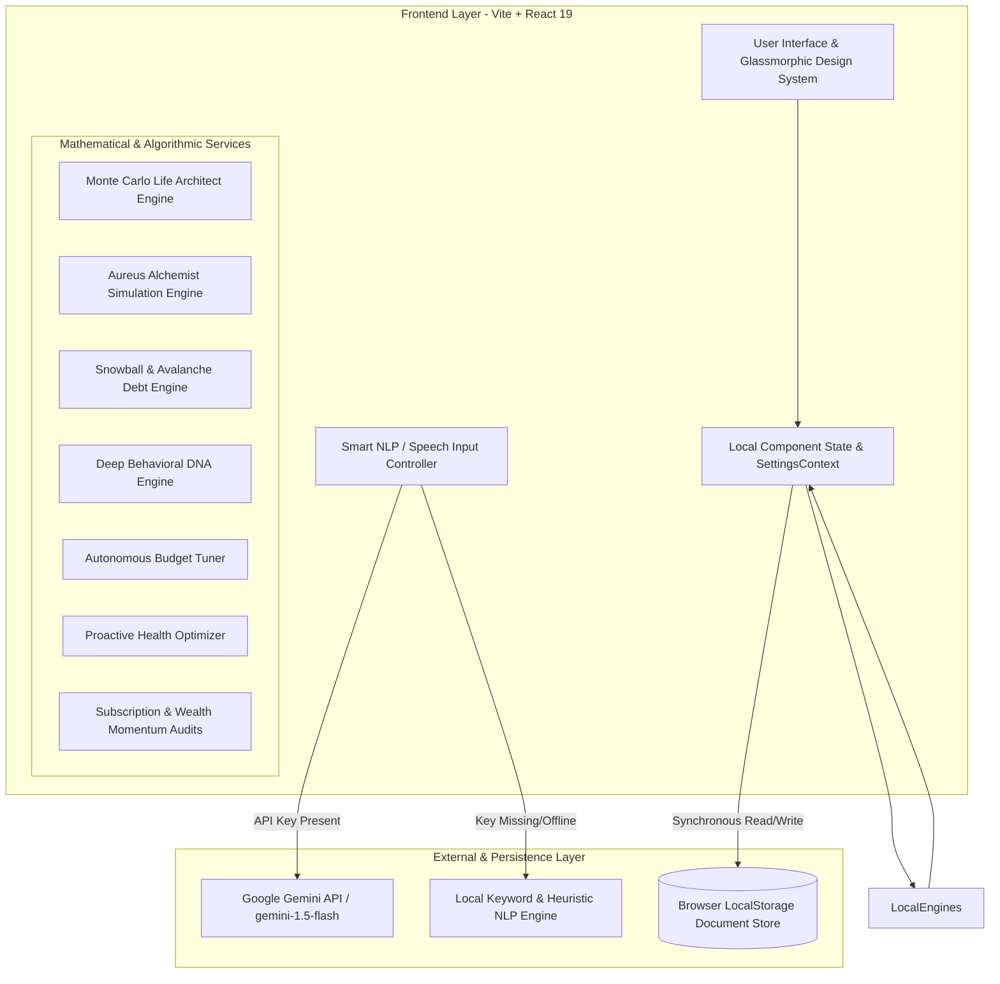

# 🏛️ Aureus — Technical Architecture & Deep-Dive Specification

> **Document Version:** 2.0.0  
> **System Name:** Aureus AI-Assisted Financial Management Platform  
> **Scope:** Full-Stack Architecture, Component Catalog, Mathematical Engines & AI Integration  
> **Status:** Active Production Architecture  

---

## 1. System Overview & Topological Architecture

**Aureus** is a forward-looking personal financial management platform built to model, predict, and optimize financial wellness. Aureus combines **statistical modeling (Monte Carlo simulations, temporal pattern extraction, real-time what-if simulations)** with **Generative AI (Google Gemini)** to provide predictive trajectory forecasting, lifestyle creep analysis, and autonomous budget tuning.

### Architectural Topology

---

## 2. Technology Stack & Dependency Inventory

### Core Frameworks & Tooling

| Technology | Version | Purpose in Project |
|:---|:---:|:---|
| **React** | `19.1.1` | Declarative UI rendering engine and component model |
| **React DOM** | `19.1.1` | DOM mounting and reconciliation |
| **TypeScript** | `5.8.2` | Static type safety and data modeling contracts (`types.ts`) |
| **Vite** | `6.4.3` | Development server (port 3000) and Rollup production bundler |
| **Tailwind CSS** | `3.4.19` | Utility-first styling framework and responsive layout grid |
| **PostCSS** | `8.5.6` | CSS transformation pipeline |
| **Autoprefixer** | `10.4.23` | Vendor-prefix CSS rule automation |

### Visualization & AI SDKs

| Package | Version | Purpose in Project |
|:---|:---:|:---|
| **Recharts** | `3.2.1` | SVG charts for Cash Flow (`BarChart`) and Category Distribution (`PieChart`) |
| **@google/genai** | `1.21.0` | Official Google GenAI SDK interfacing with Gemini 1.5 Flash (with offline fallbacks) |

> *Note:* All legacy AWS SDK packages (`@aws-sdk/client-dynamodb`, `@aws-sdk/lib-dynamodb`) have been purged from the dependencies.

---

## 3. Frontend Architecture & Design System

### 3.1 Styling System & Visual Design
* **Design Philosophy:** Executive fintech aesthetic combining dark glassmorphism, metallic gold accents, and responsive layout grids.
* **Configuration:** Defined in [tailwind.config.js](file:///c:/Users/Veera%20M/Videos/Aureus/tailwind.config.js) and [index.css](file:///c:/Users/Veera%20M/Videos/Aureus/index.css).
* **Key Visual Tokens:**
  * `glass-card`: Semi-transparent background (`rgba(15, 23, 42, 0.6)`), `backdrop-blur-xl`, with subtle 1px border highlights (`border-white/5`).
  * `glass-premium`: Enhanced glassmorphic container with 24px rounded corners and ambient border glow.
  * `text-gradient-gold`: Metallic gold gradient text clipping (`from-amber-200 via-yellow-400 to-amber-600`).
  * `animate-shimmer` & `animate-breathe`: Micro-animations for live metric pulses and indicator lights.
* **Typography:**
  * **Inter:** Primary typography across numerical tables, forms, and analytical widgets.
  * **Serif:** Applied to brand mark "AUREUS".

### 3.2 View Architecture & Navigation Flow
Managed in [App.tsx](file:///c:/Users/Veera%20M/Videos/Aureus/App.tsx) via three primary view states:
1. `'dashboard'` (Default View):
   * Executive Top Bar: Segmented view navigation, live budget/debt counters, currency switcher, notifications, and instant demo loader.
   * Top Banner: `AIInsightsWidget` (spending velocity, monthly averages, Monte Carlo preview).
   * Input Center: `SmartInput` (natural language text and Web Speech API voice capture with offline heuristic fallback).
   * Summary Cards: Total Income, Total Expense, Net Balance with monthly velocity trends.
   * Main 12-Column Responsive Grid:
     * Left (4 cols): `FinancialHealthWidget` & `BudgetProgress`.
     * Center (5 cols): `TransactionList` (with category filter chips, type toggle, CSV export, and clear search).
     * Right (3 cols): `SavingsGoals` & `RecurringManager`.
2. `'reports'` (Analytics View):
   * Rendered via `Reports.tsx`. Contains Cash Flow KPI bar charts, Category spending pie charts, CSV export, and synchronous CSV import parser.
3. `'ai'` (Aureus Intelligence View):
   * Rendered via `AIIntelligencePage.tsx`. Features:
     * **KPI Quick-Badge Strip:** Health Score, Archetype, Active Actions.
     * **Categorized Sub-Tabs:** Filter between `All Engines`, `⚗️ What-If Alchemist`, `🧠 Behavioral & Health`, `🎯 10-Yr Life Architect`, `⚡ Momentum & Subscriptions`, and `🤖 Autonomous Tuner`.
     * **Aureus Alchemist:** Interactive budget simulator with real-time sliders and predictive impact calculation.
     * **Deep Analysis Engine:** Behavioral archetype classification and spending DNA profiling.
     * **Life Architect Widget:** 10-year Monte Carlo wealth forecasting.
     * **Wealth Momentum & Subscriptions:** Heatmap and zombie subscription detection.
     * **Autonomous Budget Tuning:** AI recommendations with 1-click budget application.

---

## 4. Algorithmic Engines & Services

### 4.1 Aureus Alchemist Simulation Engine (`alchemistService.ts`)
* Simulates the mathematical downstream impact of budget adjustments (-50% to +50%):
  * **Predicted Health Score:** Recalculates debt-to-income and savings ratios dynamically.
  * **Monthly Savings Delta:** Calculates exact net cash flow changes based on adjusted expense limits.
  * **Savings Goal Acceleration:** Projects milestone impact (e.g. months saved or delayed).

### 4.2 Monte Carlo Life Architect Engine (`monteCarloEngine.ts`)
* Runs 1,000 statistical wealth trajectory iterations over a 10-year horizon.
* Incorporates market volatility ($\mu = 7\%$, $\sigma = 15\%$), inflation assumptions, and stochastic life events.

### 4.3 Deep Behavioral DNA Engine (`deepAnalysisEngine.ts`)
* Analyzes transaction variance, essential-to-discretionary spending ratios, and recurring obligations.
* Categorizes user behavior into defined archetypes (e.g., *Disciplined Builder*, *Balanced Growth*, *High-Velocity Spender*).

### 4.4 Offline Heuristic NLP Engine (`geminiService.ts`)
* Provides graceful offline degradation when `VITE_GEMINI_API_KEY` is unavailable:
  * Regex amount extraction.
  * Sentiment and keyword intent matching (`salary`, `paycheck` $\rightarrow$ Income / Salary).
  * 30+ keyword local dictionary mapping to standard categories (`groceries`, `uber`, `netflix`, etc.).

---

## 5. Persistence Layer & Document Schema

Synchronous document storage in browser `localStorage`:

| Key | TypeScript Type | Description |
|:---|:---|:---|
| `expenseTrackerTransactions` | `Transaction[]` | Historical and logged transactions |
| `expenseTrackerBudgets` | `Budget[]` | Category budget allocations indexed by month (`YYYY-MM`) |
| `expenseTrackerSavings` | `SavingsGoal[]` | Target savings goals and accumulated balances |
| `expenseTrackerRecurring` | `RecurringTransaction[]` | Recurring subscriptions and automated bill entries |
| `expenseTrackerDebts` | `Debt[]` | Revolving and installment debt records |
| `expenseTrackerSubscriptions` | `Subscription[]` | Auto-detected and manual recurring subscriptions |
| `expenseTrackerHealthMetrics` | `FinancialHealthScore` | Last computed composite health score |
| `expenseTrackerBehavioralProfile` | `BehavioralProfile` | Behavioral DNA profile and archetype classification |
| `expenseTrackerBudgetTuning` | `AutonomousBudgetTuning` | Machine learning budget optimization recommendations |
| `expenseTrackerHealthOptimization`| `ProactiveHealthOptimization` | Prescribed health action items |
